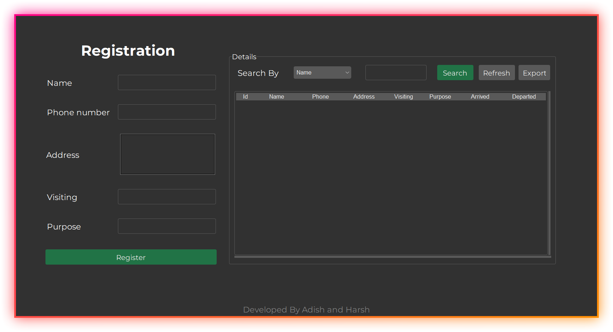

# ✨ Visitor Management System

This project showcases a Visitor Management System, straightforward yet effective solution developed for educational purposes, created using Python and SQLite. It demonstrates the utilization of tkinter module to implement a user-friendly interface for managing visitor information. With this system, users can easily handle visitor records, ensuring smooth and organized management of visitors data.

## 🍂 Features

- User-friendly GUI for effortless navigation
- Convenient functionality to add new visitors to the system
- Efficient search feature to locate visitors based on their name, address, or phone number
- Automatic calculation of entry time for accurate recordkeeping
- Mark visitors as departed once their visit is complete
- Option for saving the table's contents to a CSV file

## 🎯 To-do
- [ ] Implement admin authentication for enhanced security
- [ ] Implement functionality to update records if needed
- [ ] Implement phone number verification using OTP

## 📚 Contributions
All suggestions are welcome.

---

